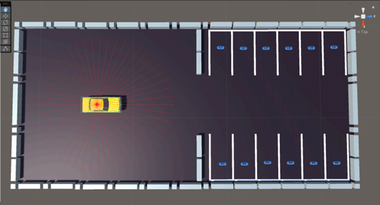
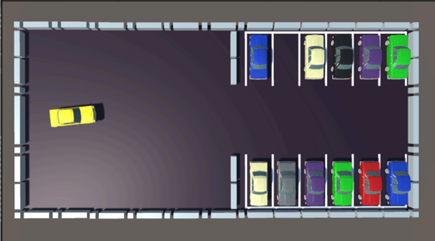

# Autonomous Car Parking using Options-Critic

## Overview

This project implements an **Autonomous Car Parking System** using the **Options-Critic Reinforcement Learning** framework. The environment for training and evaluation was sourced from an existing GitHub repository and modified as needed to optimize the performance of the reinforcement learning agent.

## The Environment

The elements of the parking lots were created using Unity's built-in tools. For the cars, ready-made models from the “Low Poly Soviet Cars Pack” were used.

<div align="center">
  
</div>


The parking lot environment is designed to include walls, parking lines, and designated parking spots. At the start of each episode, the car is placed at a random position and orientation in a large area outside the parking lot. To facilitate spatial awareness, the car is equipped with a Ray Perception Sensor mounted on top, which emits 50 rays in a 360-degree pattern. The environment consists of 12 parking spots, with 11 spots randomly occupied by parked cars, leaving one spot empty. The agent's objective is to identify and park in the empty spot during each episode.

<div align="center">
  
</div>

## Agent training

The CarAgent begins each episode at a random position and orientation, introducing sufficient stochasticity to encourage exploration and learning across a diverse range of scenarios. Based on the rewards received at each step, the agent learns to navigate toward the empty parking spot using the specified reinforcement learning algorithm, optimizing its approach to achieve the task in the most efficient manner possible.

<div align="center">
  
</div>

## State space, Action space and the Reward System:-

1. State Space
   - 50 Ray Perception Values
   - Current Torque
   - Current Steer Angle
   - Current Orientation
   - Current Position - X
   - Current Position - Y

2. Options Space
   - Find the entrance
   - Enter the parking lot
   - Find an empty parking spot
   - Park in the identified parking spot

2. Action Space
   - Torque
   - Steer Angle

3. Reward System
   - Proximity to Target
   - Alignment with Target
   - Smooth Driving
   - Stationary Penalty
   - Collision Penalty
   - Goal Rewards


## Features

- **Ray Perception:** Uses ray-based sensors to detect obstacles and navigate the environment effectively.

- **Hierarchical Reinforcement Learning (HRL):** Utilizes the Options-Critic architecture to learn sub-policies (options) for efficient decision-making.

- **Modified Environment:** Adapted from an open-source repository(see credits) and modified to better suit the parking problem.

- **Continuous Action Space:** The agent learns to navigate a parking lot with realistic vehicle dynamics.

- **Reward Shaping:** Designed to encourage smooth, efficient, and collision-free parking maneuvers.

- **Training & Evaluation:** Trained using reinforcement learning algorithms with custom options to improve sample efficiency.

## File Structure

```
├── Car/               # Modified parking environment's C# Scripts
├── Options-Critic/    # Implementation files (training)
├── Images/
├── README.md
```

## Results

After training for a sufficient number(~100000) of episodes, the agent learns to:

- Navigate to the parking space efficiently.
- Avoid obstacles and collisions.
- Perform smooth and optimal parking maneuvers.

## Credits

The environment was adapted from an open-source GitHub repository: [https://github.com/danliukuri/AutonomousParking](https://github.com/danliukuri/AutonomousParking), and necessary modifications were made to support Options-Critic and a more realistic environment.


